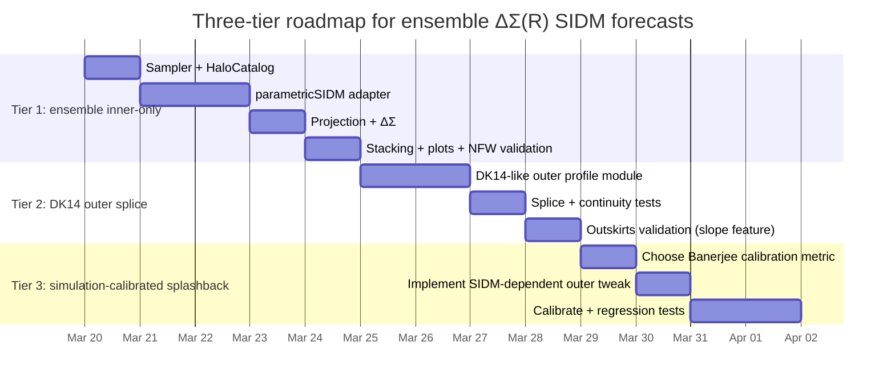

# Halo-Ensemble Stacked ΔΣ(R) Forecasts for SIDM with parametricSIDM and Splashback Modeling

## Executive summary

A halo-ensemble (“many halos, then stack”) pipeline is feasible as an extension of your current README/SPEC/PLAN, and aligns closely with how the cluster-scale analyses in entity["people","Susmita Adhikari","astro cosmology sidm"] et al. (2024) and entity["people","Arka Banerjee","astro cosmology sidm"] et al. (2019) construct predictions and interpret splashback-sensitive observables. citeturn18view0turn16view1turn5view0

Key takeaways:

- **Ensemble stacking is straightforward to implement** once you have (i) a sampler producing a catalog of halo parameters (M, z, c, optional Γ, weights), (ii) a per-halo profile generator (CDM → SIDM mapping), (iii) a projector for Σ(R) and ΔΣ(R), and (iv) a stacker that averages either 3D then projects or projects then averages, with explicit conventions. citeturn10view2turn8view3turn18view0
- **parametricSIDM can provide a 3D density profile for individual halos (inner/virial region)** using calibrated parametric evolution and “transfer” from CDM halo parameters; the repo explicitly supports generating halo samples and making SIDM predictions (hybrid/integral approaches). citeturn10view2turn10view3turn11view3  
  However, **parametricSIDM is not, by itself, a splashback model**: it is focused on gravothermal evolution and inner structure, and does not natively encode the outer steepening/truncation + infall structure that drives splashback in stacked profiles. citeturn11view5turn3view1turn23view3
- **Splashback treatment differs materially between the two target papers**:  
  - Banerjee+2019 measure splashback (and its changes under SIDM) directly in **cosmological N-body SIDM simulations**, defining the splashback radius by the **minimum of the logarithmic slope** of the stacked density profile, and show that the *shift* can depend on halo concentration/formation history and on the SIDM model (including velocity/angle dependence). citeturn16view1turn5view0turn20view1  
  - Adhikari+2024 compare ACT×DES weak-lensing ΔΣ to **(i) N-body SIDM simulations for elastic SIDM** and **(ii) fluid gravothermal simulations for dissipative SIDM**. For their fluid runs, they build initial conditions using **DK14 profiles** (truncated Einasto + outer infall term), **evolve only the inner “virialized” term**, and then reattach the outer terms—explicitly a “hybrid inner evolution + fixed outer structure” strategy. citeturn3view1turn3view2turn8view3
- **Current constraint highlighted by Adhikari+2024 (elastic SIDM)**: using ACT×DES stacked weak-lensing profiles with their modeling, they report **σ/m < 1.05 cm²/g (95% CL)** and **σ/m < 0.5 cm²/g (67% CL)** for isotropic, elastic SIDM under their assumptions and interpolation scheme. citeturn7view9turn8view2  
  (Additional dissipative constraints are expressed in their dissipative parameterization with σ′/m and v_loss benchmarks.) citeturn13view1turn3view3
- **Recommended practical path** for a Stage-V “one-day” forecast: implement **Tier 1** (ensemble stack with parametricSIDM inner profiles + numerical projection), then **Tier 2** (splice a DK14-like outer profile to get a realistic splashback-capable baseline), and reserve **Tier 3** (simulation-calibrated SIDM splashback shifts) for extended work. The roadmap below is designed for a coding agent handoff.

## Context and key definitions

In Adhikari+2024, the weak-lensing observable is the excess surface density
\[
\Delta\Sigma(R)=\bar{\Sigma}(<R)-\Sigma(R),
\]
with Σ(R) obtained from the 3D density via an Abel-type projection. citeturn8view0turn8view2

They explicitly work in **comoving** conventions (“R is comoving distance… ρ is comoving density… Σ and ΔΣ are comoving”). citeturn6view7turn13view0  
If your forecast uses physical coordinates, you will want a single, explicit conversion layer (and consistent Σ_crit choice) so comparisons to figures/tables remain unambiguous. citeturn6view7turn13view0

Two “stacking order” conventions matter:

- **Stack-then-project**: average ρ(r) over the ensemble first, then compute Σ(R), ΔΣ(R) from the mean ρ̄(r). This is what Adhikari+2024 do for their fluid-simulation halos (“average them to get a stacked 3D density… then integrate to Σ and ΔΣ”). citeturn8view3turn3view2  
- **Project-then-stack**: compute ΔΣ_i(R) per halo, then average across halos with weights. This is usually closer to how observational estimators weight lens–source pairs, especially if Σ_crit weights vary with lens redshift. citeturn7view6turn13view2

For splashback: the “splashback feature” is associated with a sharp steepening in the outer profile related to recently accreted material reaching first apocenter; its location depends strongly on accretion rate and redshift in theoretical treatments. citeturn29view1turn23view1

## Extending the current codebase to an ensemble stack

### Feasibility assessment

Your current project skeleton (README/SPEC/PLAN) is already modular around (a) halo profile generation and (b) projection to ΔΣ, and it explicitly anticipates later extensions (e.g., 2-halo term) and benchmark comparison. The ensemble stack is a natural extension: it mainly adds a **catalog/sampling layer** and a **stacking layer** around existing per-halo computations.

This fits well with parametricSIDM’s own workflow: the repo includes scripts for generating halo samples and producing SIDM predictions for those samples (hybrid/integral approaches). citeturn10view2turn10view3

### Required modules, I/O, and interfaces

Below is a minimal module map that extends your existing plan while remaining “one-day implementable.” Function signatures are designed so a coding agent can implement quickly with unit tests.

#### Ensemble sampling module

Inputs:
- cosmology (for R_Δ, ρ_crit/ρ_m if needed)
- mass definition (e.g., M200c, M200m, M500c)
- redshift distribution p(z_l)
- mass distribution p(M | selection)
- concentration model p(c | M,z) (or direct samples)
- optional accretion proxy Γ distribution (for splashback-capable DK14 parameterization)
- random seed

Outputs:
- `HaloCatalog` (arrays of halo parameters + weights)

Example signatures:

```python
from dataclasses import dataclass
import numpy as np
from typing import Literal, Optional

MassDef = Literal["m200c", "m200m", "m500c", "mvir"]

@dataclass(frozen=True)
class HaloCatalog:
    mass: np.ndarray          # shape (N,), in Msun/h or Msun (declare)
    z: np.ndarray             # shape (N,)
    conc: np.ndarray          # shape (N,)
    mass_def: MassDef
    weight: np.ndarray        # shape (N,), normalized or unnormalized
    gamma: Optional[np.ndarray] = None  # accretion proxy Γ, if used

def sample_halo_catalog(
    n_halos: int,
    regime: Literal["cluster", "dwarf"],
    seed: int,
    mass_def: MassDef,
    z_params: dict,
    mass_params: dict,
    conc_params: dict,
    weight_scheme: dict,
    gamma_params: Optional[dict] = None,
) -> HaloCatalog:
    """Draw halo parameters and stacking weights for a forecast run."""
```

Motivation from Adhikari+2024: their cluster ensemble is explicitly drawn to match observed redshift/mass distributions, using halos from multiple snapshots and “weigh them appropriately,” plus a mean-redshift sample at z≈0.48. citeturn18view0turn6view6

#### SIDM wrapper module (parametricSIDM adapter)

Inputs (per halo):
- CDM halo parameters (mass, concentration, z; and any parametricSIDM-required derived quantities such as NFW scale parameters)
- SIDM parameterization choice (e.g., σ/m constant; or effective σ_eff)
- model choice: “basic/hybrid/integral” (as in repo usage)
- assumptions about truncation of τ and σ_eff tuning (explicit knobs)

Outputs:
- radial grid r
- 3D density ρ_SIDM(r)
- optionally ρ_CDM(r) (for ratios)

Example signatures:

```python
import numpy as np
from typing import Literal

SIDMModel = Literal["cdm", "sidm_const_sigma_eff"]

def rho_of_r_parametricSIDM(
    r: np.ndarray,
    mass: float,
    conc: float,
    z: float,
    mass_def: str,
    sidm_model: SIDMModel,
    sigma_over_m: float,          # cm^2/g, interpreted per model
    method: Literal["basic", "hybrid", "integral"] = "basic",
    tau_max: float = 1.1,
    sigma_eff_tuning: float = 1.0,
) -> np.ndarray:
    """
    Return ρ(r) for one halo using parametricSIDM mapping.
    """
```

Key caveats you should keep explicit in config:
- parametricSIDM truncates gravothermal phase τ at ~1.1 and notes uncertainty in t_c normalization. citeturn10view3turn10view2
- parametricSIDM notes that σ_eff depends on an approximate effective velocity dispersion and “may require adjustment” depending on the specific SIDM model. citeturn10view3turn11view0

These map directly onto `tau_max` and `sigma_eff_tuning` knobs.

#### Projection module (Σ, ΔΣ)

Inputs:
- r grid and ρ(r) (physical or comoving)
- R grid for lensing
- line-of-sight integration choices (z_max or r_max, quadrature)

Outputs:
- Σ(R), ΔΣ(R)

Example signatures:

```python
def sigma_R_from_rho(
    R: np.ndarray,
    r: np.ndarray,
    rho: np.ndarray,
    r_max: float,
    method: Literal["los_simpson", "abel_gauss"] = "los_simpson",
) -> np.ndarray:
    """Compute projected surface density Σ(R) from spherical ρ(r)."""

def delta_sigma_R(
    R: np.ndarray,
    Sigma: np.ndarray,
    method: Literal["cumtrapz"] = "cumtrapz",
) -> np.ndarray:
    """Compute ΔΣ(R) = mean(<R) - Σ(R)."""
```

Adhikari+2024 provide the exact integral forms used (Eqs. 3–4) and implement stacking/projection consistently with those definitions. citeturn8view0turn8view2

#### Stacking module

Inputs:
- halo catalog
- per-halo profiles or per-halo ΔΣ
- weights (including optional Σ_crit weight proxy)

Outputs:
- stacked profiles + covariance proxy if desired

Example signatures:

```python
from typing import Dict

def stack_profiles(
    profiles: np.ndarray,     # shape (N, nR) or (N, nr)
    weights: np.ndarray,      # shape (N,)
    axis: int = 0,
) -> np.ndarray:
    """Weighted average along halo axis."""

def compute_stacked_deltasigma(
    catalog: HaloCatalog,
    R: np.ndarray,
    sidm_params: dict,
    projection_params: dict,
    stacking_order: Literal["project_then_stack", "stack_then_project"] = "project_then_stack",
) -> Dict[str, np.ndarray]:
    """
    Returns dict with keys like:
      - 'DeltaSigma_CDM', 'DeltaSigma_SIDM'
      - 'Sigma_CDM', 'Sigma_SIDM' (optional)
      - 'rho_stack' (optional)
    """
```

This makes it easy to reproduce Adhikari’s “stack 3D then integrate” path for fluid-like modeling, or switch to “project then stack” for observational weighting. citeturn8view3turn7view6

#### Output/reporting module

Inputs:
- stacked curves, ratios, Δχ² forecast metric (from your SPEC)
- metadata: run config, provenance, git hash, timestamp

Outputs:
- `.npz` arrays and a markdown/figure summary

Example interface:

```python
def save_run_bundle(
    out_dir: str,
    config: dict,
    results: dict,
) -> None:
    """Write arrays + config for reproducibility."""
```

### Pipeline flowchart

```mermaid
flowchart TD
  A[Run config] --> B[Sample HaloCatalog: M,z,c,(Γ),weights]
  B --> C1[CDM profile generator]
  B --> C2[SIDM wrapper: parametricSIDM]
  C1 --> D1[ρ_CDM(r)]
  C2 --> D2[ρ_SIDM(r)]
  D1 --> E1[Projection: Σ_CDM(R), ΔΣ_CDM(R)]
  D2 --> E2[Projection: Σ_SIDM(R), ΔΣ_SIDM(R)]
  E1 --> F[Stacking + weights]
  E2 --> F
  F --> G[Diagnostics: ratios, NFW checks, slope checks]
  G --> H[Forecast metric: Δχ² or required precision]
  H --> I[Outputs: npz + plots + markdown summary]
```

## Halo ensemble design for cluster and dwarf regimes

This section gives **practical sampling strategies** that are implementable in a day, while remaining compatible with the way the target papers build their stacks. Where a quantity is not specified by the papers, it is marked **unspecified** and offered only as an example.

### Cluster regime (∼10¹⁴ M⊙ halos)

#### Paper-anchored ensemble features

Adhikari+2024 define an observed cluster sample (from ACT×DES) selected with **SNR > 4** and **0.15 < z < 0.7**, with **908 clusters** and mean mass **3.1×10¹⁴ h⁻¹ M⊙** (as described in their text) and they use seven simulation snapshots in that redshift range, “weigh them appropriately.” citeturn7view1turn18view0

For their simulation-to-data matching, they describe:
- choosing a **lower mass threshold** so the mean halo mass matches an observed **M500c = 2.72×10¹⁴ h⁻¹** (units in the PDF text are garbled; the intended unit is mass) and requiring **>1000 particles within R500c** for their simulation halos. citeturn18view0
- using **ROCKSTAR** for catalogs. citeturn18view0turn16view1
- projecting along the simulation **z-axis** for the N-body observable, and then constructing ΔΣ via the same definitions (Eqs. 3–4). citeturn8view3turn8view0

These features can be mimicked in your ensemble forecaster without running simulations by drawing (M,z) from the observed-like distributions and weighting accordingly.

#### One-day sampling strategy (recommended)

Goal: get a stable stacked ΔΣ ratio (SIDM/CDM) with O(1%) Monte Carlo noise in the stack.

- Redshift: draw z ∼ Uniform(0.15, 0.7) (or approximate the true p(z) if available; otherwise mark as unspecified and keep uniform to avoid hidden assumptions). Motivated by their selection range. citeturn7view1turn18view0
- Mass: draw log M from a lognormal distribution centered on **3×10¹⁴ h⁻¹ M⊙**, scatter **0.2–0.3 dex (example; unspecified by papers)**, then optionally apply a cut M > M_min tuned so the sample mean matches the target mean (Adhikari’s approach). citeturn18view0turn7view1
- Concentration: draw c from a mass–concentration relation + log-scatter **σ_ln c ≈ 0.2 (example; unspecified)**.
- Weights:  
  - simplest: w_i = 1  
  - closer to lensing: w_i ∝ ⟨Σ_crit(z_i)⁻²⟩ × N_src(z_i) (requires a source distribution; unspecified in your current scope). Adhikari’s estimator uses Σ_crit-weighted source weights in data. citeturn7view6turn6view7
- Sample size: **N = 200–500 halos per SIDM point** is usually enough for smooth stacked curves if each halo evaluation is fast.

#### Extended (multi-day) sampling strategy

Goal: explore dependence on secondary properties that affect splashback (concentration/accretion).

- Use N = 5,000–50,000 halos per SIDM point.
- Include an accretion-rate proxy Γ and allow DK14 truncation parameters to vary with Γ (Tier 2/3 below). DK14 explicitly links outer steepening/truncation scales to peak height/accretion proxies. citeturn23view3turn23view1
- Split stacks by concentration quartiles to mimic Banerjee’s finding that splashback shifts are clearer in high-concentration (early-forming) subsamples. citeturn3view5turn19view2

### Dwarf regime (∼10¹⁰ M⊙ halos)

Neither Banerjee+2019 nor Adhikari+2024 are dwarf-lensing papers; they provide limited direct guidance for dwarf ensemble selection. The ensemble approach is still implementable because parametricSIDM is designed to “transfer” CDM halos into SIDM counterparts across halo mass scales and can generate halo samples. citeturn10view2turn11view3

#### One-day sampling strategy (recommended)

- Redshift: choose a narrow lens redshift bin (example: z_l = 0.2 or 0.3) to minimize Σ_crit complexity; **unspecified** by your prompt and should be set by your planned Stage-V lens sample.
- Mass: lognormal around 10¹⁰ M⊙ with scatter 0.3 dex (example; unspecified).
- Concentration: mass–concentration relation + scatter; dwarf halos typically have higher concentrations than clusters in CDM, which can amplify inner-profile sensitivity in ΔΣ.
- Weights: w_i = 1 unless you have a lens selection function (e.g., stellar mass cut, satellite fraction), which is **unspecified** here.
- Sample size: N = 500–2,000 halos per SIDM point (dwarf lensing S/N is low observationally, but MC noise in theory stacks is cheap to suppress).

#### Extended strategy

- If your dwarf regime needs subhalo treatment (e.g., dwarfs as satellites), consider parametricSIDM’s stated applicability to subhalos and its “integral approach” that uses evolution histories (more complex; likely beyond one day). citeturn10view2turn11view3
- Explicitly include baryonic potential choices (parametricSIDM supports a Hernquist-potential option) only if your forecast target requires it; otherwise keep it off for the quickest, cleanest SIDM-vs-CDM contrast. citeturn10view0turn10view2

### Example config snippets for ensemble forecasting

Minimal (Tier 1, inner-only):

```yaml
regimes:
  cluster:
    mass_def: m200c
    n_halos: 400
    z:
      dist: uniform
      zmin: 0.15
      zmax: 0.7
    mass:
      dist: lognormal
      mean_log10_M: 14.49        # example: 3.1e14 h^-1 Msun
      sigma_log10_M: 0.25        # example; unspecified
    concentration:
      model: "cM_relation"
      scatter_ln_c: 0.2          # example; unspecified
    weights:
      scheme: uniform
  dwarf:
    mass_def: m200c
    n_halos: 1500
    z:
      dist: delta
      z0: 0.30                   # example; unspecified
    mass:
      dist: lognormal
      mean_log10_M: 10.0
      sigma_log10_M: 0.30        # example; unspecified
    concentration:
      model: "cM_relation"
      scatter_ln_c: 0.2
    weights:
      scheme: uniform

sidm:
  parameterization: sigma_over_m_const
  sigma_over_m_grid: [0.0, 0.2, 0.5, 1.0, 2.0]     # aligned with Adhikari+2024 benchmarks
  tau_max: 1.1
  sigma_eff_tuning: 1.0

projection:
  R_grid:
    type: logspace
    Rmin: 0.01
    Rmax: 30.0
    nR: 80
  los:
    method: los_simpson
    zmax_over_r200: 10
```

The σ/m grid above matches the elastic SIDM benchmark range used in Adhikari+2024. citeturn13view0turn8view2

## Projection and stacking numerics with validation

### Numerical projection methods

Two robust methods are commonly used:

- **Line-of-sight integral** (recommended for numerical stability):
  \[
  \Sigma(R)=2\int_{0}^{z_{\max}}\rho\!\left(\sqrt{R^2+z^2}\right)\,dz
  \]
  with z_max chosen to exceed the halo truncation scale (or a multiple of R_200m if an outer profile is included).

- **Abel integral** as in Adhikari+2024 (Eqs. 3–4):
  \[
  \Sigma(R)=2 \int_R^\infty \rho(r)\,\frac{r\,dr}{\sqrt{r^2-R^2}}.
  \]
  citeturn8view2turn8view0

For a quick implementation, the LOS integral avoids handling the R′→R singularity explicitly and works well with spline-interpolated ρ(r).

### Radial grids and interpolation

Recommended conventions (practical, reproducible):

- Define a single **log-spaced physical radius grid** `r` for ρ(r) per halo, e.g. r ∈ [10⁻⁴ R200, 20 R200] with 400–800 points (example; tune for dwarf/cluster).
- Define a single **log-spaced projected grid** `R` for ΔΣ, matching observation bins where possible. Adhikari+2024 use **15 log-spaced bins from 0.2 to 30 h⁻¹ Mpc**, while elsewhere they mention using the profile in a smaller range (0.2–10 h⁻¹ Mpc) for constraints; treat the exact “used range” as **ambiguous** unless you decide which to match in your reproduction target. citeturn13view1turn2view1
- Use monotone-preserving interpolation for ρ(r) (e.g., `PchipInterpolator`) to avoid ringing in Σ(R), especially around steep features.

### Stacking conventions

Implement both and make it a config switch:

- `stack_then_project`:  
  1) compute ρ_i(r) on a common r grid (interpolate as needed)  
  2) ρ̄(r) = Σ w_i ρ_i(r) / Σ w_i  
  3) project ρ̄ to Σ̄, ΔΣ̄
- `project_then_stack`:  
  1) compute ΔΣ_i(R) per halo  
  2) ΔΣ̄(R) = Σ w_i ΔΣ_i(R) / Σ w_i

Adhikari+2024’s fluid procedure is an explicit example of “stack 3D then project,” while their N-body description emphasizes projection along a simulation axis (a closer analog to “project then stack” in spirit, though they still compare to the same ΔΣ definition). citeturn8view3turn18view0

### Validation tests

Your SPEC already calls for an analytic NFW check; here is a concrete minimum test suite.

1) **Analytic NFW ΔΣ check**  
Compare your numerical projection of an NFW halo to the analytic expressions in entity["people","Candace Oaxaca Wright","astronomy lensing"] & entity["people","Tereasa G. Brainerd","astronomy lensing"] (1999/2000), which derive analytic convergence/shear expressions for NFW halos (standard reference for validation). citeturn28view0turn28view1

2) **Mass consistency**  
Check that ∫ 4πr²ρ(r) dr over the intended overdensity radius matches the target M_Δ within tolerance.

3) **Resolution convergence**  
Double the r and R resolution; ΔΣ should change negligibly on the “science range” (e.g., <0.5%).

4) **Positivity/monotonic sanity**  
Ensure ρ(r) ≥ 0 and Σ, ΔΣ behave as expected (ΔΣ typically decreases with R for NFW-like profiles; exceptions may occur near steep truncations).

## Splashback in Banerjee+2019 and Adhikari+2024 and implications for parametricSIDM

### How Banerjee+2019 treat splashback

Banerjee+2019 run large-volume **cosmological SIDM simulations** by modifying **Gadget-2** to include self-interactions (probabilistic scattering within an interaction radius, following an SPH-kernel overlap scheme). citeturn4view0turn14view0turn16view1

Simulation setup highlights:
- ΛCDM cosmology (Ω_m=0.3, Ω_Λ=0.7, etc.) and two boxes: (1 h⁻¹ Gpc)³ and a higher-resolution (500 h⁻¹ Mpc)³, both with 1024³ particles; softening 0.015 h⁻¹ Mpc (large box) and 0.0075 h⁻¹ Mpc (smaller box). citeturn16view1turn16view2
- Halos identified with ROCKSTAR; focus cluster-mass halos in 1–2×10¹⁴ h⁻¹ M⊙. citeturn16view1turn4view8

SIDM parameter space explored (their Table 1):
- Velocity-independent isotropic: σ/m = 1 and 2 cm²/g (with corresponding σ_T/m values). citeturn20view0turn14view6
- Velocity-independent anisotropic: σ_T/m = 1 and 3 cm²/g with a specified angular dependence (Eq. 2.5) and momentum-transfer normalization. citeturn20view0turn3view8turn14view2
- Velocity-dependent, angle-dependent: characterized by (w,u) = (500,1000), (1600,2000), (1000,2000) km/s. citeturn20view0turn3view8

Splashback definition and findings:
- They define the splashback radius of the stacked sample as the **minimum of the logarithmic slope** of the stacked density profile. citeturn5view1turn14view7
- When stacking **all halos**, they find little visible movement of the splashback radius, even for large cross sections, but do find **shallowing of the splashback feature** in some cases. citeturn14view7turn5view0
- When splitting by concentration (a proxy for formation history), they find **high-concentration halos can show a smaller splashback radius in SIDM**, with larger effects for larger cross sections (their discussion around splashback dependence on concentration). citeturn3view5turn5view0

### How Adhikari+2024 treat splashback

Adhikari+2024 model the weak-lensing observable using:
- **Cosmological N-body SIDM simulations** for elastic, isotropic SIDM (eSIDM). They simulate a (1000 h⁻¹ Mpc) box with 1024³ particles and Planck cosmology parameters, and implement scattering in an optimized Gadget-2 following Rocha et al.-style probabilistic interactions. citeturn6view6turn6view1
- **Semi-analytical fluid simulations** for dissipative SIDM (dSIDM), following gravothermal evolution equations (as in Essig et al. 2019 lineage) under spherical symmetry and hydrostatic equilibrium. citeturn18view2turn17view7

Their explicit splashback handling comes via the **DK14 profile framework**, used in their fluid pipeline to provide realistic outer structure and dynamic range:
- They state they use DK14 profiles generated with Colossus, and describe DK14 as having (I) an inner Einasto term truncated near the virial radius to accommodate splashback, and (II) an outer infall term. citeturn3view1turn3view0
- For fluid simulations, they “only keep track of the gravothermal evolution of the inner term” and then “return the outer terms” afterward—i.e., splashback-capable outer terms are retained without being evolved by SIDM in their approximation. citeturn3view2turn3view1
- They note infalling matter can heat SIDM halos and slow evolution, but they disregard it and cite that the accretion rate for 10¹⁴ halos at z=0.48 is typically Γ≈1.5–2. citeturn3view2turn18view0

### Can parametricSIDM reproduce splashback?

**Not by itself, in the sense used by Banerjee+2019 and Adhikari+2024.**

Reasoning grounded in the sources:

- parametricSIDM is designed as a **parametric gravothermal evolution / CDM→SIDM transfer** model using effective constant cross sections and calibrated evolution of profile parameters; it is focused on the inner halo and (depending on approach) on evolution histories. citeturn10view0turn11view3turn11view0
- The parametric-model paper explicitly notes limitations of the basic approach for halos with late-time mass changes including “splashback events” (in the sense of halo histories and Vmax/Rmax evolution), indicating that nontrivial outer dynamics are not captured by the simplest transfer. citeturn11view5turn11view6
- Splashback in these papers is fundamentally tied to **outer non-equilibrium structure** and accretion physics; DK14-type truncation/transition terms encode steepening near R200m and require accretion proxies for calibration. citeturn23view3turn29view1turn23view1

Therefore, parametricSIDM alone is best viewed as an **inner-profile engine**, while splashback requires an **outer-profile engine** (DK14-like) or direct simulation calibration.

### Concrete hybrid approaches to add splashback capability

#### Tier 2 hybrid (recommended): splice a DK14-like outer profile onto a parametricSIDM inner profile

This mirrors Adhikari+2024’s “evolve inner, reattach outer” philosophy, but with parametricSIDM as the inner evolution engine. citeturn3view2turn10view3

Implementation sketch:

1) Build a **baseline CDM outer profile** using a DK14-style form:
   - DK14 introduces a transition/truncation term f_trans with calibrated truncation radius r_t related to peak height ν (or other proxies). One explicit DK14 form is:
     \[
     f_{\rm trans}=\left[1+\left(\frac{r}{r_t}\right)^{\beta}\right]^{-\gamma/\beta},
     \]
     with parameterizations where β and γ are fixed and r_t depends on ν and R200m. citeturn23view3turn23view1
2) For each halo, compute the **parametricSIDM inner density** ρ_SIDM(r) on a dense r-grid.
3) Choose a **matching radius** r_match (example: 0.8 R200m or a few scale radii; **unspecified**—make it a config).
4) Define the hybrid density:
   - for r ≤ r_match: ρ_hyb(r) = ρ_SIDM(r)
   - for r > r_match: ρ_hyb(r) = ρ_CDM,DK14(r) × A, where A is chosen to enforce continuity at r_match (and optionally continuity of d ln ρ / d ln r).
5) Project ρ_hyb to Σ and ΔΣ.

Acceptance tests for Tier 2:
- In the CDM limit, the DK14-only implementation should reproduce the expected steepening around R200m as in DK14. citeturn23view1turn23view3
- In the SIDM limit, inner ratios ρ_SIDM/ρ_CDM should qualitatively match parametricSIDM outputs.

Limitations (explicit):
- SIDM-induced modifications of splashback itself (drag/disruption effects) are not captured unless you additionally modify the DK14 truncation parameters based on SIDM.

#### Tier 3 hybrid: simulation-calibrated splashback corrections on top of Tier 2

Use Banerjee+2019 as calibration guidance:

- They show that the **splashback radius shift** is not prominent in the full stack but appears in **high-concentration subsamples**, and that the **depth/shallowness of the slope minimum** changes with cross section. citeturn5view0turn3view5

Concrete implementation steps:

1) Add a nuisance parameterization for splashback modification, e.g.
   - r_t → r_t × (1 + a_sp × f(σ/m) × g(c))
   - γ → γ × (1 + b_sp × f(σ/m))
   where g(c) upweights high-concentration halos (e.g., percentile rank in c distribution).
2) Calibrate a_sp, b_sp (or simpler one-parameter shift) by matching the **ratio of log-slope profiles** around splashback in Banerjee’s figures for one or two SIDM benchmarks. (Exact calibration targets depend on which figure you choose; mark as **implementation choice**.)
3) Propagate the calibrated splashback changes into ΔΣ via projection.

This is more effort but yields a path to “SIDM affects splashback” rather than “SIDM only affects the inner profile.”

## Reproducing Adhikari+2024 stacked ΔΣ: required inputs and caveats

To reproduce their stacked ΔΣ predictions (as opposed to merely making a generic forecast), you need several inputs beyond a single “fiducial halo.”

### Observational-side ingredients (from their paper)

- Lens selection: ACT DR5 clusters with SNR>4 and 0.15<z<0.7, 908 clusters in the DES×ACT overlap, mean mass reported as ~3.1×10¹⁴ h⁻¹ M⊙. citeturn7view1turn2view1
- ΔΣ estimator and weights: their Appendix defines the estimator with Σ_crit weights and metacalibration response factors, plus boost-factor correction for contamination. citeturn7view6turn7view7
- Radial binning: 15 logarithmically spaced bins from 0.2 to 30 h⁻¹ Mpc are stated for shear measurement, while other parts reference using a smaller radial range for constraints; choose explicitly which range you target. citeturn13view1turn2view1
- Covariance: jackknife covariance with 100 patches is described. citeturn7view7

### Simulation/model-side ingredients (from their paper)

Elastic SIDM (N-body):
- Simulation volume: 1000 h⁻¹ Mpc with 1024³ particles; Planck cosmology parameters are listed; softening 0.015 h⁻¹ Mpc. citeturn6view6turn6view1
- SIDM implementation: probabilistic interactions following Rocha et al. with SPH kernel overlap, in optimized Gadget-2. citeturn6view1turn18view0
- Benchmarks: σ/m = 0.2, 0.5, 1.0, 2.0 cm²/g plus CDM; interpolation in σ/m via cubic spline at each radial bin. citeturn13view0turn7view9turn8view2

Halo sample matching:
- They extract cluster halos matching the observed distribution by setting a lower mass threshold so the mean matches M500c ≈ 2.72×10¹⁴ h⁻¹ (mass) and use seven snapshots between 0.15<z<0.7 with appropriate weights; details of the full mass/redshift weighting function are not fully specified in the text and should be treated as **unspecified unless you obtain their code/data**. citeturn18view0

Dissipative SIDM (fluid):
- They evolve only the inner term of DK14-like profiles and reattach outer terms afterward; boundary conditions and justification re accretion heating are stated. citeturn3view2turn3view1

### Minimal reproducibility target (practical)

For a “close-enough” reproduction without their private code:

- Match their **σ/m benchmark grid** and **radial bins**.
- Use your halo ensemble sampled to match:
  - z range 0.15–0.7 and mean z ≈ 0.48
  - mean mass ≈ 3×10¹⁴ h⁻¹ M⊙ (or M500c ≈ 2.72×10¹⁴ h⁻¹ M⊙)
- Adopt comoving vs physical conventions consistently with their equations if comparing directly to their plotted RΔΣ units. citeturn6view7turn13view0

## Deliverables, roadmap, and acceptance criteria

### Tiered implementation plan with task estimates

Estimates assume a competent coding agent working in Python with scientific stack, focusing on correctness over polish.

#### Tier 1: Ensemble inner-only (parametricSIDM + projection + stacking)

Core outputs: stacked ΔΣ(R) for CDM and SIDM for dwarf+cluster regimes, plus ratios and a simple detectability proxy.

Tasks (estimated hours):
- Implement `HaloCatalog` and sampling (lognormal M, simple z, c scatter): 2–3h
- Implement parametricSIDM adapter (import + call + return ρ(r) on grid; document assumptions τ_max and σ_eff tuning): 4–6h citeturn10view3turn10view2
- Implement projection (LOS integral) + ΔΣ computation: 3–4h citeturn8view2turn8view0
- Implement stacking (two orders) + plotting: 2–3h citeturn8view3turn7view6
- Validation vs analytic NFW (Wright & Brainerd): 2–3h citeturn28view0turn28view1  
Total: ~13–19h

Acceptance criteria:
- NFW analytic agreement ≤1–2% over a clean radial range (excluding extreme inner/outer truncation radii).
- Deterministic run with fixed seed reproduces identical stacked curves.
- Produces dwarf+cluster CDM and SIDM stacked ΔΣ and ratios for σ/m grid.

#### Tier 2: Ensemble + DK14 outer splice (splashback-capable baseline)

Core outputs: same as Tier 1, but with DK14-like outer steepening/truncation so splashback is present in CDM baseline.

Tasks (estimated hours):
- Implement DK14-like profile component(s): truncated inner term + outer infall/power-law term; expose parameters (r_t, β, γ, outer slope). 4–6h citeturn23view3turn3view1
- Implement splice logic: choose r_match, enforce continuity; add tests for continuity and mass behavior. 3–5h
- Regression tests: CDM DK14-only reproduces expected steepening near R200m (qualitative + slope minimum exists). 2–3h citeturn23view1turn23view3  
Total: ~9–14h

Acceptance criteria:
- CDM stacked profile shows a clear steepening feature around the expected halo boundary scale when plotted as d ln ρ / d ln r (3D) or an analogous projected diagnostic.
- Turning “outer splice” on/off changes only the outskirts (inner ΔΣ remains consistent).

#### Tier 3: Simulation-calibrated SIDM splashback (Banerjee-informed corrections)

Core outputs: SIDM-dependent modifications to splashback location/depth in stacked ΔΣ.

Tasks (estimated hours):
- Extract calibration targets from Banerjee+2019 (choose specific figure/metric: e.g., shift in slope-min radius vs concentration bin): 2–4h citeturn5view0turn3view5
- Implement nuisance correction model for DK14 truncation parameters as function of σ/m and concentration percentile: 2–4h
- Fit calibration parameters to match Banerjee’s reported qualitative shifts; document limitations: 3–6h
- End-to-end comparison plots and sensitivity checks: 3–5h  
Total: ~10–19h

Acceptance criteria:
- For at least one Banerjee benchmark, the model reproduces the sign and approximate magnitude of splashback feature change in the chosen metric (within **tolerance you define explicitly**, e.g. ±5–10% in r_sp shift).

### Roadmap Gantt chart



## Comparison table of methods

| Method | Physics included | SIDM parameterization | Splashback capability | Velocity dependence | Primary outputs | Reproducibility level |
|---|---|---|---|---|---|---|
| parametricSIDM (by Daneng Yang) | Parametric gravothermal evolution; CDM→SIDM transfer; supports sample generation and multiple approaches; notes τ truncation and σ_eff tuning | Effective constant cross section σ_eff (and mapping from CDM parameters); details depend on chosen SIDM model | Not a native splashback model; does not encode outer infall/truncation unless augmented | Designed to incorporate velocity/angle dependence via σ_eff concept (model-dependent) | ρ(r), and related internal properties (Vmax/Rmax etc); can generate halo samples | High for inner profiles given inputs; outer boundary behavior requires external modeling citeturn10view2turn10view3turn11view0turn11view5 |
| Banerjee+2019 cosmological SIDM simulations | Full N-body gravitational dynamics + explicit SIDM scattering (isotropic/anisotropic/velocity-dependent), halo/subhalo structure | σ/m, σ_T/m, and (w,u) velocity-dependent models (Table 1) | Yes: splashback measured from stacked slope minimum; shows dependence on concentration/formation history | Yes: includes a velocity- and angle-dependent differential cross section, plus anisotropic cases | Stacked ρ(r), slope profiles, subhalo distributions; splashback radius shifts | Medium–high if simulation outputs available; otherwise qualitative calibration only citeturn16view1turn20view0turn5view0turn3view8 |
| Adhikari+2024 ACT×DES lensing constraints (N-body + fluid) | N-body SIDM (elastic) + fluid gravothermal sims (dissipative); compares to observed ΔΣ | eSIDM: σ/m ∈ [0,2]; dSIDM: σ/m, σ′/m plus v_loss benchmarks (Table 1) | Yes via DK14-based profile framework (truncated Einasto + infall), esp. in fluid pipeline; outer terms reattached after inner evolution | In this paper, elastic and dissipative cases are treated as velocity-independent “for simplicity” | Stacked ρ(r), Σ(R), ΔΣ(R) across full radial range; constraints on σ/m | High for reproducing if selection/weights and halo matching are known; some details (weights across snapshots, exact matching) are underspecified in text citeturn6view6turn3view1turn3view2turn7view9turn13view1 |

